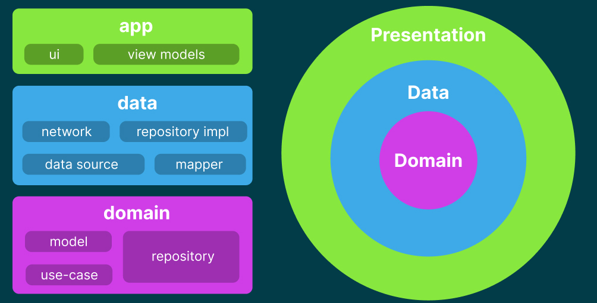

# Overview

### TODO
- [ ] CI/CD
- [ ] Testing Presentation Layer.
- [ ] Lints.
- [ ] Contribution readme.
- [ ] Refactor State in viewmodels.
- [ ] Implement MVI for compose and viewmodel commununcation.


This README provides an overview of the architecture and components used in the Android project.



### How to build the project?

Please place the API key in the `local.properties` file as follows:
```api-key=YOUR_API_KEY```

### Libraries

- Minimum SDK Level: 24
- Compiled SDK Level: 33

### Dependencies

- Android Components
- Retrofit: For network requests.
- Gson: For parsing JSON.
- Glide: For image loading for Gif.
- Hilt & Hilt Tests: For dependency injection.
- Turbine: For testing flows.
- mockk: For mocking objects in tests in kotlin.
- MockWebServer: For mocking network requests in tests.

### Data Layer

- Network: WebApi
- Source: RemoteDataSource
- Repository: GiphyRepository
- Model: GiphyAppModel

### App Layer

- ViewModels: RandomViewModel, SearchViewModel

### User Interface

- ComposeUI: DetailScreen, HomeScreen
- Activity: ComposeActivity

## Explanation about Architecture

MVVM + DataBinding + Hilt + Coroutines + Retrofit + Glide

### API Key Handling

To handle the API key requirement, we've implemented an interceptor at the root level of the network
requests. The API key is securely stored in the `local.properties` file.


### Network Validation and Error Handling

I used to inject network validators into data sources class, in order to check network connection before making network requests. But I discovered that out that network checking
APIs in android are not reliable, for example if the device is connected to a wifi network but internet is not available, the network checking API will return true. So I decided to remove the network checking logic.
The most suitable way to prompt network error is to hit an API call and wrap it around try catch. and prompt the correct error message to the user.

## Tests

- I choose custom mocking to test interfaces for testing, and for Android's components, I used mockk.
- I have included unit tests for various components, including data sources, repositories, webApi,
  and utility classes. While considering time constraints, we have aimed to cover essential units
  and ensure the reliability of the codebase.
- In addition to unit tests, we have also included tests for activities and fragments. Under
  the `usecase` folder in `androidTest`, there is a comprehensive test flow that simulates a user's
  interaction with the app, covering the entire user journey.
